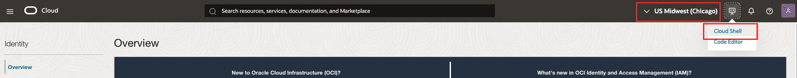
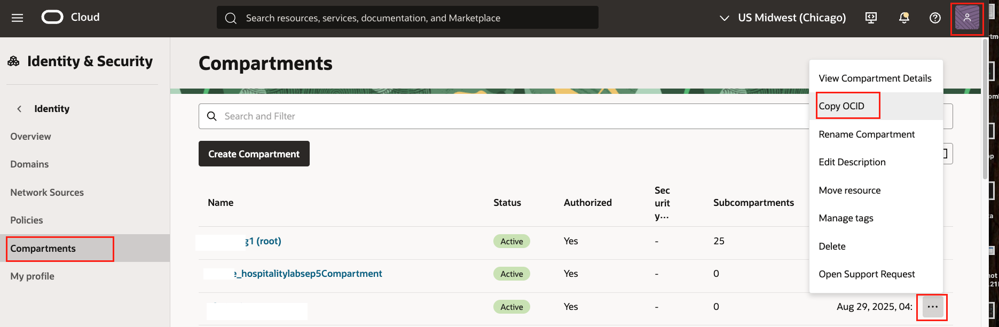
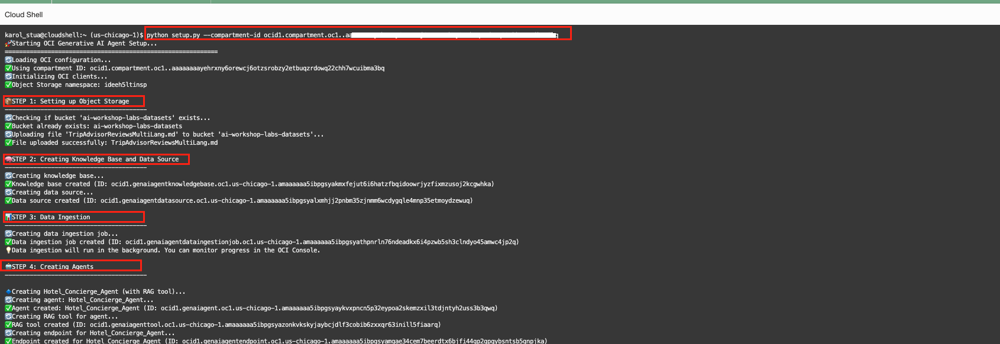

# Lab 2: Build an Agentic Hotel Concierge

### Introduction
This lab guides you through creating an AI Concierge. In this version, we'll use a Python script to quickly create all the necessary components (agent, knowledge base, and tools) automatically.

Three months after implementing her AI review analysis system, Maria, General Manager of the Grand Plaza Hotel, can now quickly understand and respond to guest reviews in multiple languages, greatly improving guest satisfaction ⭐⭐⭐⭐⭐ and response times ⏱️. A new challenge arose: identifying patterns across complaints like noisy construction, slow Wi-Fi, or event disruptions. Manually tracking these across spreadsheets and review platforms is slow and error-prone.

The solution is an AI Concierge 🛎️ using Retrieval Augmented Generation (RAG) that can instantly search thousands of reviews, identify trends, provide context-aware responses, and solve real-time issues. Maria can now ask the AI questions like *"How many guests reported Wi-Fi issues this month?"* or *"What event disrupted guests last weekend?"* and get instant insights.

### Objectives
In this lab, you will build the AI Concierge using Retrieval Augmented Generation (RAG) and complete three main tasks:

- Run a script to upload the dataset and create the KnowledgeBase and agent.  
- Create and Test your First Agent with Retrieval Augmented Generation (RAG).  

### Prerequisites
This lab assumes you have the following:

- Access to Oracle Cloud Infrastructure (OCI), paid account or free tier, in a region that has Generative AI.  
- Basic experience with OCI Cloud Console and standard components.  
- The `handson-lab` repository cloned.  

Estimated Time:  45-50 minutes

Tasks
---
## Task 1: Setup OCI config file
        
Setting up the OCI config file is important because it tells OCI tools who you are and which region to use.  
For this workshop, we’ll set the region to `us-chicago-1` since Generative AI is available there.  
    
1.  Change your region to us-chicago-1 by selecting it from the region dropdown at the top-right corner. Then open Cloud Shell from the top-right corner of the OCI Console.

    *Note: If you use your own tenancy, make sure you are subscribed to us-chicago-1 region.*

    


2.  You can set up your OCI CLI configuration in two ways. Choose either the automatic setup or the manual setup (only one is needed) 

    ## Option 1: Automatic Setup (Script)

    Run the script below to set up your OCI config automatically:

        
    ```bash
    <copy>
    git clone https://github.com/karolgit/ocigenai-BuildingAnAgenticHotelConcierge-files.git
    mkdir .oci
    cd ~/ocigenai-BuildingAnAgenticHotelConcierge-files
    python setup_user_api_key.py
    </copy>
    ```


    ## Option 2: Manual Setup (Script)

    Run the following command for the interactive, step-by-step OCI config.  

    
    ```bash
    <copy>
    oci setup config
    </copy>
    ```


    Follow the prompts and enter the required details when asked:
    -   Enter a location for your config [Hit Enter]
    -   Tenancy OCID (Enter your tenancy OCID, see screenshots below)
    -   User OCID (enter our user OCID, see screenshots below)
    -   Region (enter us-chicago-1)
    -   Enter 'Y' to generate API signing Key
    -   Path to the directory of the public and private key files (press Enter to let it generate automatically)
    -   Enter Passphrase and reconfirm as "N/A"


        

        

        

          

    Once completed, a private key will be created locally, and a public key will be generated. To view the newly created public key, run:
    
    ```bash
    <copy>
    cat ~/.oci/oci_api_key_public.pem
    </copy>
    ```       

    Copy the entire output and paste it into the OCI Console under:    Profile → Tokens & Keys → Add API Key → Paste a Public Key    

            


    Verify your config file works:    

    ```bash
    <copy>
    oci os ns get
    </copy>
    ```

    If it returns your namespace, your config is correctly set up .
    
      

## Task 2: Create ObjectStorage, Knowledge-base and Agent

In this task, you'll run a script in cloud shell before we test the AI agents. This script will create object storage, knowledge-base and Agents. 

1.  Run setup.py in CloudShell.

    If you are deploying resources into a compartment other than the root compartment, you need to provide the Compartment OCID.

    *Note: Choose one of the two options below and do not run both:*

    ## Option 1: Provide the compartment OCID directly

    You can find the compartment OCID in the OCI Console by clicking your profile icon in the top-right corner, selecting your email, choosing Compartments from the side menu, and then selecting the appropriate compartment to copy its OCID.

    
    
    ```bash
    <copy>
    cd ~/ocigenai-BuildingAnAgenticHotelConcierge-files
    python setup.py --compartment-id YOUR-COMPARTMENT-OCID
    </copy>
    ```
    ⚠️ Important: Replace *YOUR-COMPARTMENT-OCID* with the OCID from the OCI Console.
    
    


    ## Option 2: Use the default profile from config (no OCID needed)
    ```bash
    <copy>
    cd ~/ocigenai-BuildingAnAgenticHotelConcierge-files
    python setup.py
    </copy>
    ``` 
    .   


*Note:* 

*If you run the script in your own tenancy and if you get any error on limits, you need to request to increase the Generative-Agent count, Knowledgebase count and Agent Endpoint count limits.*


## Task 3:  View your newly created resources

1.  View the newly created storage bucket and the uploaded dataset in the UI.
       - Click on the hamburger menu in the upper left of the console to open the menu
       - Click on **Storage**
       - Under **Object Storage & Archive Storage** click on **Buckets** (*make sure to select the OCI compartment you provisioned to*)
       - Click in to **ai-workshop-labs-datasets**

        
        

3.  Explore your newly created knowledge base and the data source in the UI.
       - Click on the hamburger menu in the upper left of the console to open the menu
       - Click on **Analytics & AI**
       - Under **AI Services** click on **Generative AI Agents**
       - Click on **Knowledge Bases** on the left side of the screen
       - Click in to **Hotel_Concierge_Knowledge_Base**

        
        

4.  Confirm that the agents have been created successfully in the UI.
       - Click on **Knowledge bases** in the upper left
       - Click on **Agents**

        

## Task 4: Test Your RAG agent

 1. Once the agent is active, click Launch chat. Test its knowledge from the dataset to
    confirm the RAG tool is working:
       - Click on **Chat** on the left side
       - Select *Hotel_Concierge_Agent* for the **Agent**
       - Select *Hotel_Concierge_Agent_Endpoint* for the **Agent endpoint**
       - Copy the below text and paste it in **Type a message...** field and submit

```
<copy>
"Summarize the most common positive comments people make about their rooms."
"Are there any negative reviews that mention the check-in process?"
</copy>
```   


*Note: If the chat does not return the expected results, check whether the ingestion job has failed. If it has, raise a support ticket for assistance.*
  


---

## Acknowledgements  

**Authors:**  
- Felipe Garcia, Master Principal Cloud Architect 
- Karol Stuart, Master Principal Cloud Architect  

**Last Updated by/Date** – Karol Stuart, August 2025  
